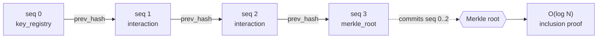
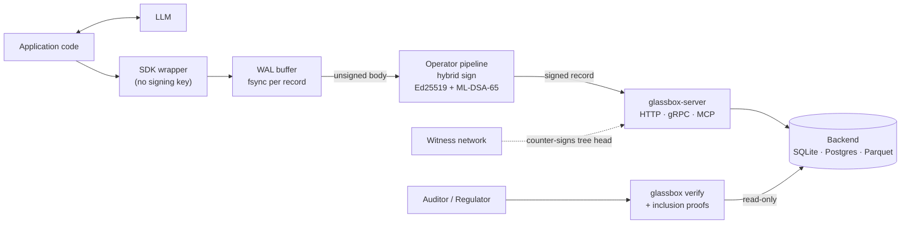
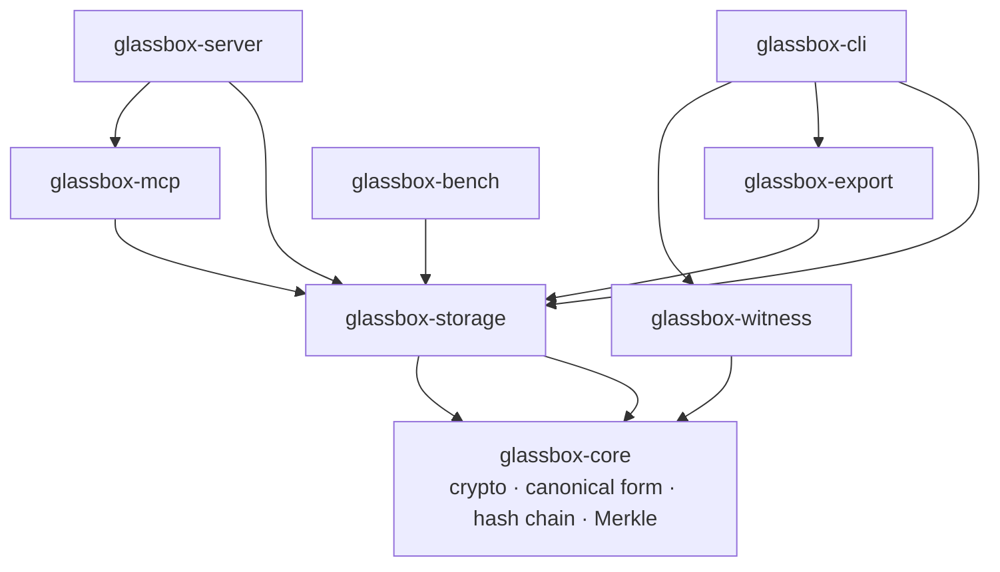

# Glassbox

> **Tamper-evident audit ledger for AI systems.**

[](LICENSE)
[](rust-toolchain.toml)
[](#status)

Glassbox sits between your application and any LLM and records every
interaction in a **hash-chained, cryptographically signed, append-only
log**. Each entry captures content hashes of the inputs and outputs,
the model and prompt fingerprints, tool calls, retrieval provenance,
human-approver identities, and arbitrary caller metadata — enough for a
regulator to reconstruct exactly what your system did, when, under what
version, and under whose oversight.

A single altered byte anywhere in the log is mathematically detectable.
The bundled verification CLI walks the chain, checks every signature and
hash link, validates every Merkle root, and exits non-zero at the first
record where any invariant breaks — naming the exact sequence.

---

## Why

Audit logs that live in a mutable database prove nothing against an
operator who can edit that database. Regulations like the EU AI Act,
HIPAA, the Colorado AI Act, and NYC Local Law 144 increasingly require
**durable, attributable evidence** of how automated decisions were made
— retained for years and verifiable by a third party who does not trust
your infrastructure.

Glassbox provides that evidence as a cryptographic primitive rather than
a policy promise:

- **Tamper-evident** — SHA-256 hash chain plus RFC 6962-style Merkle
  trees. Modification, reordering, or silent deletion all break the
  chain.
- **Forgery-resistant, post-quantum ready** — every record carries a
  **hybrid Ed25519 + ML-DSA-65** signature. Forging an entry requires
  breaking *both* a classical and a lattice-based scheme.
- **Third-party verifiable** — O(log N) inclusion proofs let an external
  auditor confirm a specific record is in the log without replaying it.
- **Built for 10-year retention** — hot storage (SQLite/Postgres) with
  an eventual automatic tier-down to cold Parquet on object storage.

---

## How it works

| Layer | Guarantee |
|-------|-----------|
| **Canonical form** | RFC 8785 (JCS) canonical JSON gives byte-stable hashing and signing across languages and versions. |
| **Hash chain** | Every record embeds the SHA-256 hash of its predecessor (`prev_hash_hex`). |
| **Hybrid signature** | Ed25519 + ML-DSA-65, combined under a registry-resolved combiner — `AND` (both halves required, default) or `OR` (either sufficient, for emergency key rotation). |
| **Merkle commitments** | Periodic `merkle_root` records commit a batch; inclusion proofs are independently verifiable. |
| **Key registry** | Signing keys are registered as on-ledger administrative records, so every rotation is itself auditable. |
| **Redaction** | `tombstone` records redact a target while preserving proof that something was removed and what its original hash was. |

The wire format, canonical form, and hash construction are pinned by a
frozen **2000-record cross-version regression corpus**; any drift fails
CI.

Records form an append-only chain. Each one embeds its predecessor's
hash and carries its own hybrid signature; periodic `merkle_root`
records commit a batch so any single entry can be proven present with an
O(log N) inclusion proof:



> Every record is independently signed (Ed25519 + ML-DSA-65). Breaking
> the chain requires forging both signature halves **and** recomputing
> every downstream `prev_hash` **and** any Merkle root that commits it.

---

## System overview

Your application talks to its LLM as usual; the SDK observes each call
and emits an **unsigned** interaction body into a durable local WAL. The
operator's pipeline — the only component that holds signing keys — signs
records and appends them to the ledger. An auditor verifies the chain
read-only, trusting the operator's public key but not their database.



---

## Install

Build from source (binary releases land once the wire format stabilises):

```sh
git clone https://github.com/farooqarahim/glassbox
cd glassbox
cargo install --path crates/glassbox-cli
```

You now have a `glassbox` binary on your `PATH`. Requires Rust 1.88+.

---

## Quickstart

```sh
# 1. Generate a hybrid keypair and initialise a ledger + stream.
glassbox keygen --out tenant.key
glassbox init --ledger ledger.db --tenant acme --system credit-scoring-v3 \
    --key tenant.key

# 2. Append an interaction. The body is canonical JSON for one call.
cat > interaction.json <<'EOF'
{
  "input":  { "hash_algorithm": "SHA-256", "hash_hex": "abcd1234", "byte_size": 1234 },
  "output": { "hash_algorithm": "SHA-256", "hash_hex": "ef015678", "byte_size": 256 },
  "model":  {
    "provider": "anthropic", "model_name": "claude-opus-4-8",
    "model_version": "20260119",
    "sampling": { "temperature": 0.2, "max_tokens": 1024 }
  },
  "tags": [{ "key": "decision_id", "value": "loan-12345" }]
}
EOF
glassbox append --ledger ledger.db --stream acme/credit-scoring-v3 \
    --key tenant.key --body interaction.json

# 3. Periodically commit a Merkle root over the recent batch.
glassbox merkle-commit --ledger ledger.db --stream acme/credit-scoring-v3 \
    --key tenant.key

# 4. Verify: every signature, every hash link, every root.
glassbox verify --ledger ledger.db --stream acme/credit-scoring-v3
# OK  stream=acme/credit-scoring-v3  records=2  signatures=2  merkle_roots=1
```

`verify` exits `0` only if the whole stream checks out. Tamper with the
underlying database and it exits `1` with a diagnostic naming the first
broken record:

```
glassbox: verification FAILED on stream acme/credit-scoring-v3:
  hash mismatch at sequence 1: stored this_hash 14c0be… does not match canonical hash 70a9a4…
```

---

## Ways to use it

All surfaces share the same cryptographic core and the same
capability-token auth model.

| Surface | Use it for | Entry point |
|---------|-----------|-------------|
| **CLI** (`glassbox`) | Ops, scripting, manual audits, compliance exports | `keygen` · `init` · `append` · `verify` · `show` · `streams` · `merkle-commit` · `key-rotate` · `redact` · `witness-publish` / `witness-check` · `export annex-iv` · `retention-set` · `legal-hold place` / `release` |
| **HTTP / JSON server** (`glassbox-server`) | Apps in any language over REST | `POST /v1/streams/{s}/append`, `/verify`, `GET /v1/streams`, `/last`, `/records`, inclusion proofs — bearer-token auth |
| **gRPC** | Microservices and typed clients | Same server, `--features grpc`: tonic + Protobuf, seven RPCs |
| **MCP server** (`glassbox-mcp`) | Claude Desktop / IDE agents logging their own actions | JSON-RPC 2.0 over stdio, 7 tools: `record_interaction`, `record_tool_call`, `record_retrieval`, `record_human_decision`, `record_sub_agent`, `query`, `verify_inclusion` |
| **SDKs** (Python · TypeScript · Go) | Embedding in application code | `glassbox` (PyPI) · `@glassbox/sdk` (npm) · `github.com/farooqarahim/glassbox/sdks/go` |

### SDK example (Python)

```python
import anthropic
from glassbox import Client, WalBuffer, wrap_anthropic

with Client("http://glassbox.internal:7878", token="…", stream_id="acme/credit") as gb:
    with WalBuffer(gb, path="./wal.jsonl") as wal:
        # Wrap your model client — every call now emits a Glassbox
        # interaction body that flows through a durable local WAL
        # and on to the ledger.
        raw = anthropic.Anthropic()
        wrapped = wrap_anthropic(raw, on_interaction=wal.enqueue_interaction,
                                 model_version="20260119")
        wrapped.messages.create(model="claude-opus-4-8", messages=[...])
```

> **Trust boundary.** No SDK ever holds a signing key. Records are signed
> by the operator's pipeline; SDKs only ship already-signed JSON. The
> keystore stays under operator control regardless of the language your
> application is written in.

---

## Compliance features

- **Annex IV export** (`glassbox export annex-iv`) — a zipped package
  with a JSON sidecar populated from real ledger queries, every record
  as `stream.jsonl`, and a signed `manifest.json` of per-artifact
  SHA-256 hashes. PDF rendering ships under the `pdf` feature.
- **Retention policies** as on-ledger records, with reference templates
  for EU AI Act high-risk, HIPAA, NYC AEDT, Colorado AI Act, and a
  generic 3-year default.
- **Legal hold** (`legal-hold place` / `release`) — release is rejected
  unless a matching hold is open.
- **Witness network** — a witness counter-signs observed tree heads and
  detects rewinds and forks, giving tamper-evidence even against the
  operator. RFC 3161 trusted timestamping is available under the `tsa`
  feature.

---

## Architecture

```
glassbox/
├── crates/
│   ├── glassbox-core/      canonical form, hash chain, hybrid signing, Merkle tree
│   ├── glassbox-storage/   Backend trait + SQLite / in-memory / Postgres / Parquet
│   ├── glassbox-witness/   witness network + RFC 3161 TSA client
│   ├── glassbox-export/    Annex IV JSON sidecar + PDF export
│   ├── glassbox-mcp/       Model Context Protocol server (7 tools)
│   ├── glassbox-server/    HTTP/JSON + gRPC surfaces, capability-token auth
│   ├── glassbox-bench/     reproducible latency/throughput harness
│   └── glassbox-cli/       the `glassbox` binary
└── sdks/                   python · typescript · go
```

Every crate depends inward toward `glassbox-core`; nothing depends on a
surface crate. The dependency graph is a strict DAG:



`glassbox-core` is the **only** crate where cryptography lives. It
forbids `unsafe` and warns on `missing_docs` at the workspace level;
changes to its public API require two reviewers (spec §11.2).

Optional backends and surfaces are gated behind Cargo features —
`postgres`, `parquet`, `grpc`, `tsa`, `pdf` — so the default build stays
lean and hermetic.

---

## Threat model

Glassbox detects, against an adversary with full storage access:

- Any modification, reordering, or silent deletion of records — a single
  hash mismatch is dispositive.
- Forgery against either the classical or the post-quantum half of the
  hybrid signature.

Without the witness network, a self-hosted ledger is verifiable by any
party who trusts the operator's **signing key** but not their database —
the same property Sigstore Rekor had before its gossip protocol matured,
and still far stronger than a mutable audit log. The witness network
closes the remaining gap against the operator themselves. See spec §23
for the full enumeration.

---

## Status

**`v0.7-alpha`.** The wire format, canonical form, and hash construction
are stable for the v0.x series and guarded by the cross-version
regression corpus. Older chains continue to verify under newer binaries
without migration.

The cryptographic core has **not** been externally audited. Do not rely
on Glassbox for production regulatory artifacts until v1.0 GA, which
includes the external audit committed to in spec §23.8. The only
spec-named engineering item remaining for v1.0 is the `glassbox-ffi` C
ABI. See [CHANGELOG.md](CHANGELOG.md) for the per-release history.

---

## Contributing

See [CONTRIBUTING.md](CONTRIBUTING.md). Contributions are accepted under
Apache 2.0 with a Developer Certificate of Origin sign-off (no CLA).

Security issues: **do not open public issues** — see [SECURITY.md](SECURITY.md).

---

## License

Apache License 2.0. See [LICENSE](LICENSE) and [NOTICE](NOTICE).
